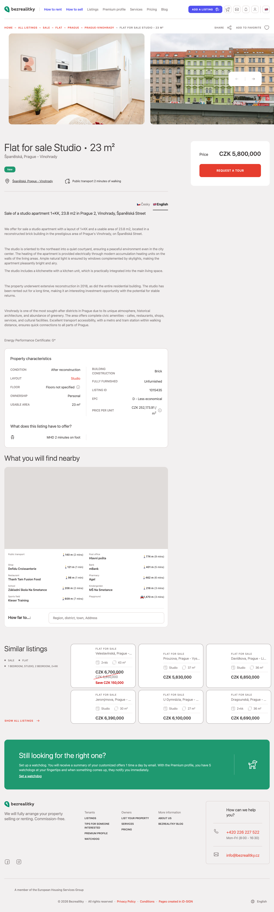
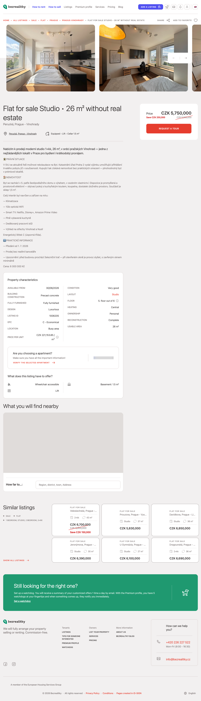

# Srovnatelné nemovitosti (Praha 2 — Královské Vinohrady)
_(RU: сопоставимые предложения · EN: sale comparables)_

**Předmět ocenění:** studio / 1+kk, Praha 2 — Královské Vinohrady, pozdně-historický dům po celkové rekonstrukci, výtah, vybaveno, pronajato (LTR 19 800 CZK/měs. all-in · STR 4,89★ / 180 recenzí). Plocha TBD v pásmu 20–30 m². Asking **5 600 000 CZK**.

## Tabulka / Summary table

| # | Adresa | Cena (CZK) | m² | CZK/m² | Dispozice | Patro | Stav / rok | Výtah · sklep · vybavení | Zdroj |
|---|--------|-----------:|---:|-------:|-----------|-------|------------|---------------------------|-------|
| A | Španělská, Praha 2 — Vinohrady | 5 800 000 | 23,8 | **243 697 / m²** | studio 1+kk | n/a (klidný vnitroblok) | po rekonstrukci (dům i jednotka, r. 2018) · cihla | bez výtahu uvedeno · bez sklepu · nezařízeno · dlouhodobě pronajato | bezrealitky 1015435 [1] |
| B | Perucká, Praha 2 — Vinohrady | 5 750 000 | 26,0 | **221 154 / m²** | studio 1+kk | 5./6 | velmi dobrý · kompletní rekonstrukce | výtah ✓ · sklep 1,5 m² · plně vybaveno · klima · PENB C | bezrealitky 1006205 [2] |
| C | Pod Zvonařkou, Praha 2 — Vinohrady | 6 351 000 | 29,0 | **219 000 / m²** | studio 1+kk | zvýšené přízemí | dobrý stav · cihlový dům | bez výtahu · zděný sklep 2,1 m² · kompletně zařízeno · PENB G | iDNES Reality / ereality [3] |

## Klíčové detaily

**Comp A — Španělská (bezrealitky 1015435).** Studio 1+kk, 23,8 m², 5 800 000 CZK. Cihlový dům v prémiové části Vinohrad, kompletní rekonstrukce domu i jednotky (r. 2018), orientace do klidného vnitrobloku, přímé vytápění akumulačními panely. Jednotka je dlouhodobě pronajatá — prezentována jako investiční příležitost. MHD 2 min chůze. PENB D. Jednotková cena **243 697 CZK/m²** je horní okraj Vinohradů pro studio této velikosti. [1]

**Comp B — Perucká (bezrealitky 1006205).** Studio 1+kk, 26 m², 5 750 000 CZK (snížená cena z původních 6 000 000). 5. patro z 6, výtah, sklep 1,5 m². Plně zařízeno, klimatizace, 1Gb optika, PENB C. Dům panelový, kompletní rekonstrukce. **Pozn.:** jednotka je vedena jako nebytový prostor; SVJ aktuálně řeší rekolaudaci na byt, Katastrální úřad Praha 2 vydal výjimku pro trvalý pobyt. Předání od 1. 7. 2026. Upozornění inzerenta: před budovou železniční trať (rušné při otevřeném okně). Jednotková cena **221 154 CZK/m²** = středový benchmark. [2]

**Comp C — Pod Zvonařkou (iDNES Reality / ereality 341d2b1b).** Studio 1+kk, 29 m², 6 351 000 CZK. Cihlový dům s funkčním SVJ, zvýšené přízemí s okny v úrovni 1. patra (cca 3,6 m nad zemí), orientace do vnitrobloku. Zděný sklep 2,1 m², kompletně zařízeno (dřevěné pódium s výsuvnými postelemi, oddělená kuchyně). Měsíční náklady 3 490 CZK. Tramvaj pár kroků, metro I. P. Pavlova ~7 min. PENB G (neposkytnuto, třída přiřazena dle předpisu). Jednotková cena **219 000 CZK/m²** je pro Vinohrady standard. [3]

## Shrnutí pro subjekt

Všechny tři komparátory jsou **živě inzerované 1+kk studia v Praze 2 — Vinohradech v pásmu 5,75–6,35 M CZK / 23,8–29 m²**. Průměrná jednotková cena trojice = **227 950 CZK/m²**; mediánem je Comp B na **221 154 CZK/m²**.

Aplikováno na asking 5 600 000 CZK subjektu:

| Scénář plochy | Implikovaná CZK/m² subjektu | Pozice vůči trojici (medián 221 154) |
|---|---:|---|
| 20 m² | **280 000** | +27 % nad mediánem — top-of-market |
| 25 m² | **224 000** | +1,3 % nad mediánem — v trhu |
| 30 m² | **186 667** | −16 % pod mediánem — pod trhem |

**Závěr:** Asking 5,6 M je v porovnávací metrice **plně obhajitelný v pásmu 24–27 m²**. Pod 23 m² se cena dostává nad Comp A (243 697 CZK/m²) a vyžaduje explicitní prémie (STR track record, výtah, hotovostní vybavenost). Nad 28 m² je asking **pod** tržním mediánem Vinohrad — cena je pak implicitně podhodnocená vůči komparátorům.

Zpřesnění plochy subjektu je jediný datový bod, který posouvá tezi o jeden ze tří směrů: agresivní (20–22 m²) · tržně-spravedlivá (24–27 m²) · konzervativní / s rezervou (28–30 m²).

## Sources

[1]: https://www.bezrealitky.com/properties-flats-houses/1015435-nabidka-prodej-bytu-spanelska "Bezrealitky inzerát 1015435 — Španělská, Praha-Vinohrady, studio 1+kk 23,8 m², 5 800 000 CZK, po rekonstrukci 2018, cihla, dlouhodobě pronajato. Odeznačeno 23. 4. 2026."
[2]: https://www.bezrealitky.com/properties-flats-houses/1006205-nabidka-prodej-bytu-perucka-praha "Bezrealitky inzerát 1006205 — Perucká, Praha-Vinohrady, studio 1+kk 26 m², 5 750 000 CZK (redukce z 6 000 000), 5./6 patro, výtah, sklep 1,5 m², plně vybaveno, klima, PENB C. Odečteno 23. 4. 2026."
[3]: https://www.ereality.cz/detail/prodej-bytu-1-kk-29-m%C2%B2/341d2b1bbba6cbef "ereality.cz / iDNES Reality — Pod Zvonařkou, Praha 2 Vinohrady, studio 1+kk 29 m², 6 351 000 CZK, cihla, zvýšené přízemí, sklep 2,1 m², kompletně zařízeno, PENB G. Odečteno 23. 4. 2026."
